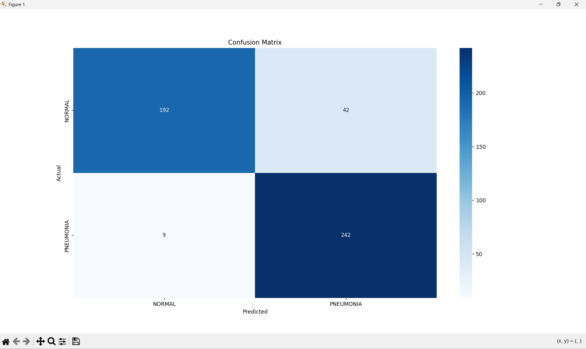
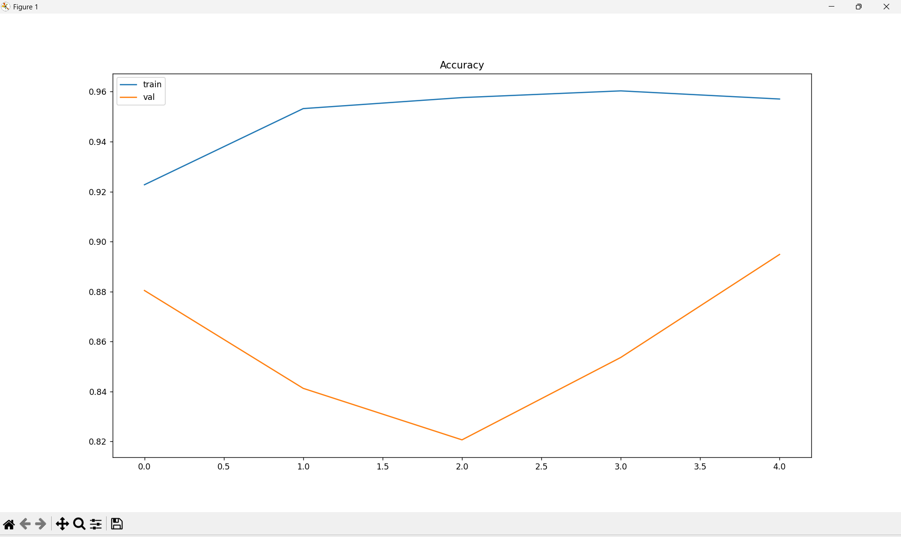
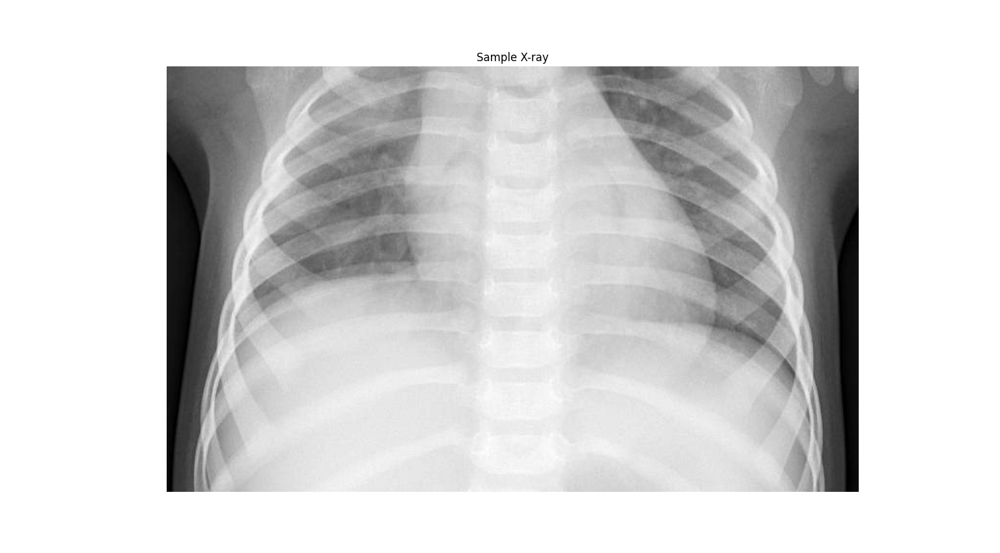
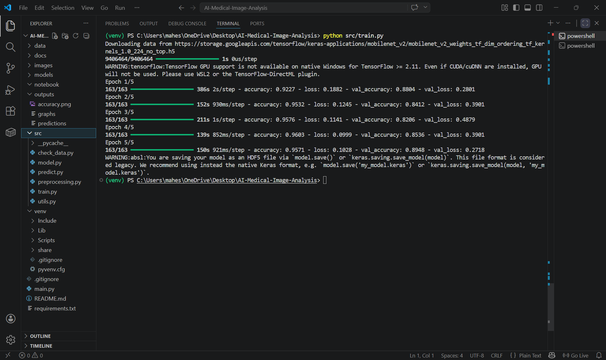
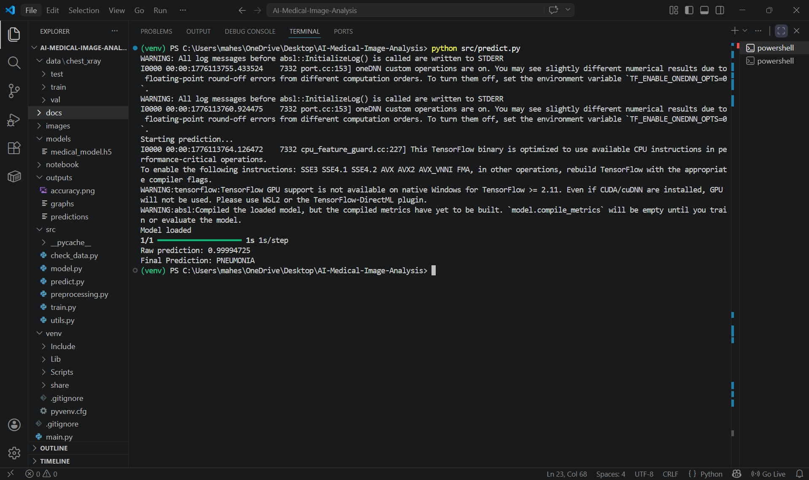

## AI-POWERED MEDICAL IMAGE ANALYSIS SYSTEM

[]  
[]  
[]

---

##  SYSTEM OVERVIEW

This project is an AI-powered medical image analysis system built using deep learning. It analyzes chest X-ray images and classifies them into two categories: **NORMAL** and **PNEUMONIA**. The system simulates real-world diagnostic assistance used in hospitals and radiology centers.

---

##  PROBLEM STATEMENT

Manual diagnosis of medical images is time-consuming and prone to human error. Radiologists often deal with large volumes of scans, which can lead to delayed or incorrect diagnosis. This project aims to automate disease detection using AI to assist healthcare professionals.

---

##  INDUSTRY RELEVANCE

AI-based medical imaging systems are widely used by healthcare companies like Google Health, IBM Watson Health, and Siemens Healthineers.

These systems:
- Assist doctors in faster diagnosis  
- Reduce human error  
- Improve early disease detection  
- Scale healthcare services efficiently  

---

## SYSTEM ARCHITECTURE

Chest X-ray Dataset → Image Loading → Preprocessing (Resize, Normalize, Augmentation) → Feature Extraction (MobileNetV2) → Model Training → Prediction Engine → Evaluation Metrics → Confusion Matrix → Visualization Output

---

##  USAGE

python src/train.py  
python src/predict.py  
python src/evaluate.py  

---

##  TECH STACK

Python, TensorFlow/Keras, OpenCV, NumPy, Matplotlib, Seaborn, MobileNetV2 (Transfer Learning)

---

##  DATASET

Chest X-Ray Pneumonia Dataset  

Classes:
- NORMAL  
- PNEUMONIA  

The dataset simulates real-world radiology data used for disease detection.

---

##  RESULTS

Accuracy: ~89%  

- High recall for pneumonia detection (96%)  
- Model effectively detects disease cases  
- Some false positives (normal classified as pneumonia)  

### Confusion Matrix

### Accuracy Graph

---

##  PROJECT STRUCTURE

AI-MEDICAL-IMAGE-ANALYSIS/  
├── data/  
│   └── chest_xray/  
│       ├── test/  
│       ├── train/  
│       └── val/  
├── docs/  
├── images/  
│   ├── accuracy.png  
│   ├── confusion_matrix.png  
│   ├── evaluate.png  
│   ├── predicted.png  
│   ├── sample_xray.png  
│   └── training.png  
├── models/  
│   └── medical_model.h5  
├── notebook/  
├── outputs/  
│   ├── accuracy.png  
│   ├── confusion_matrix.png  
│   ├── graphs  
│   └── predictions  
├── src/  
│   ├── check_data.py  
│   ├── evaluate.py  
│   ├── model.py  
│   ├── predict.py  
│   ├── preprocessing.py  
│   ├── train.py  
│   └── utils.py  
├── main.py  
├── requirements.txt  
└── README.md  

---

##  OUTPUT SCREENSHOTS

---

##  LIMITATIONS

- Dataset is limited and simulated (not real hospital data)  
- Model may produce false positives  
- Performance can improve with larger and more balanced datasets  

---

##  NOTE

This project demonstrates a complete AI-powered medical image analysis system with real training, prediction, evaluation, and visualization. It simulates how AI assists doctors in disease detection and decision-making.
